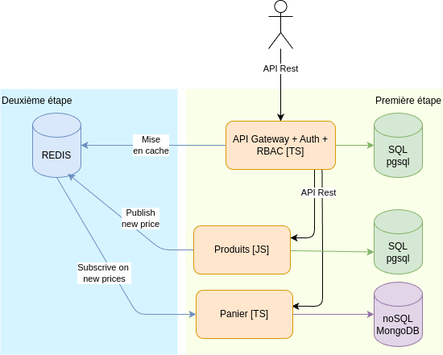

# Architecture simplifiée

L'architecture appliquée pendant ce cours sera simplifiée, tout en gardant la logique et les principes fondamenteaux des microservices.

* L'`API Gateway` se chargera également de gérer l'authentification et le RBAC
* Les services métiers seront réduits à 2 :
  * `Produits`
  * `Paniers`
* `Redis` servira à la fois de cache et de service de communication asynchrone
* Le service discovery est supprimé et les addresses des services sont codées en dur dans l'API Gateway. `Produits` et `Panier` ne communiquent pas directement entre eux.
* Les données du panier seront stockées en `noSQL` avec une redondance des informations produits
* La mise en production ne sera pas vu, mais l'environnement de développement sera Dockerisé
* La surveillance des services n'est pas abordée

## Endpoints

Les services seront simplifiés et ne comporteront que les endpoints principaux :

* Gateway
  * `POST /auth` : Authentifie un utilisateur
* Products
  * `GET /products` : Récupère la liste des produits
  * `POST /products` : Crée un produit
  * `PUT /products/:id` : Modifie un produit
* Carts
  * `GET /carts/:id` : Récupère le panier d'un utilisateur
  * `POST /carts/:id/product/:id` : Ajoute un produit au panier, crée le panier si inexistant
  * `PUT /carts/:id/product/:id` : Modifie la quantité d'un produit dans le panier

L'API Gateway se chargera de filtrer les requêtes en fonction de l'utilisateur avec un middleware, puis de les rediriger vers le service approprié.

## RBAC

| Endpoint | Role | GET | POST | PUT | DELETE |
|----------|------|-----|------|-----|--------|
| /auth | public | | ✅ | | |
| /products | admin | ✅ | ✅ | ✅ | |
|  | user | ✅ | | | |
| /carts/:id | admin | ✅ | | | |
|  | user | 👤 | | | |
| /carts/:id/product/:id | admin | ✅ | ✅ | ✅ | |
|  | user | 👤 | 👤 | 👤 | |

✅ autorisé 👤 autorisé sur les données appartenant à l'utilisateur authentifié
